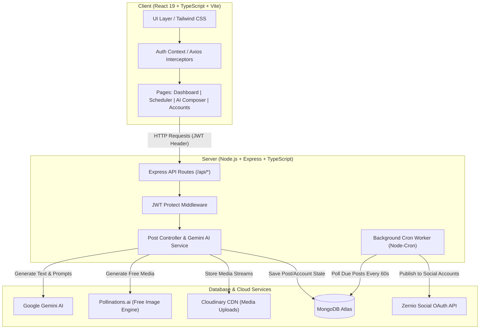
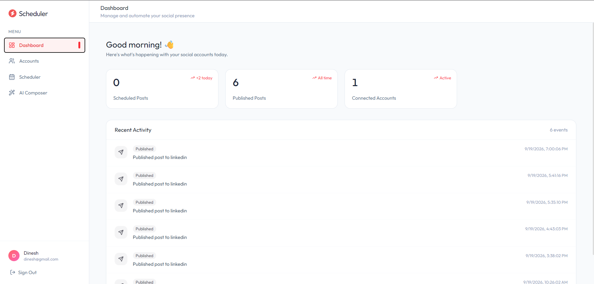
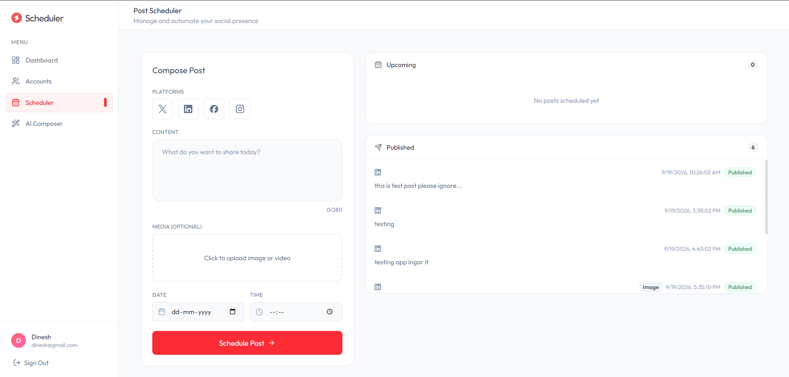
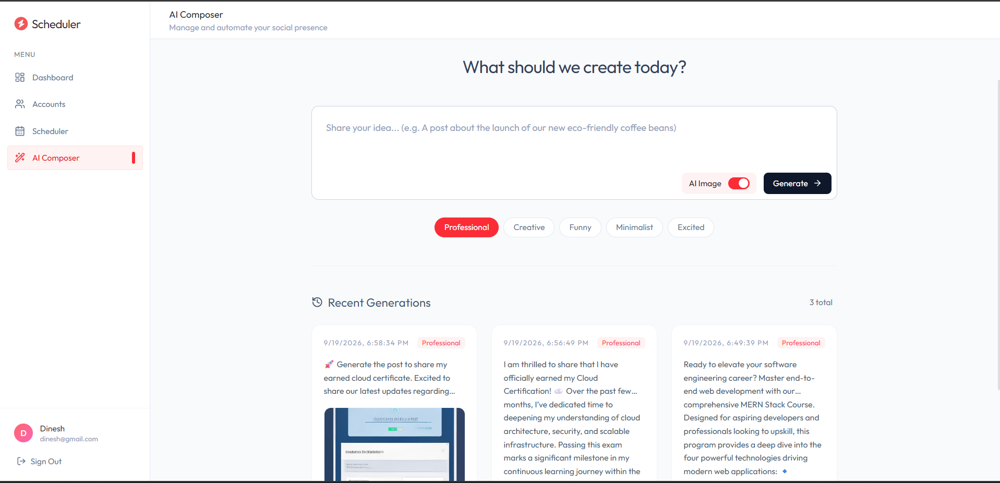
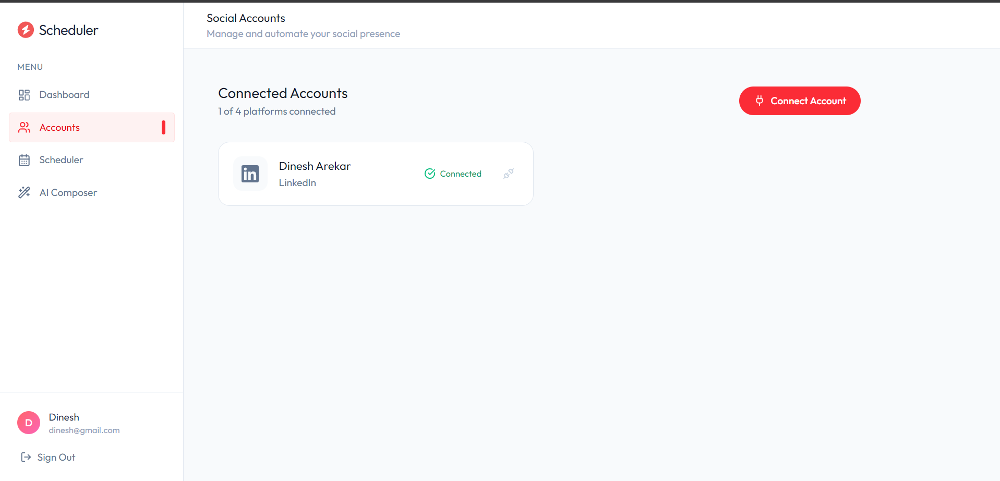

# 🚀 SocialScheduler — AI-Powered Multi-Platform Social Media Automation

<div align="center">


**An enterprise-grade, full-stack social media scheduling & AI automation platform that empowers creators and businesses to draft, generate, and auto-publish content across Twitter/X, LinkedIn, Facebook, and Instagram.**

[Key Features](#-key-features) • [Architecture](#-system-architecture) • [Pages Walkthrough](#-page-by-page-walkthrough) • [API Documentation](#-api-documentation) • [Local Setup](#%EF%B8%8F-getting-started--local-setup)

</div>

---

## 💡 Overview & Value Proposition

**SocialScheduler** is built to solve the fragmentation and overhead of managing social media campaigns across multiple networks. By combining **Google Gemini AI**, **Pollinations.ai Image Generation**, **Cloudinary CDN Storage**, **Zernio Social OAuth**, and an automated **Node-Cron background worker**, SocialScheduler provides an end-to-end publishing pipeline.


## ✨ Key Features

- 🤖 **AI Content Studio**: Generates tailored social posts, hashtags, and descriptive image prompts using Google Gemini AI (`gemini-2.0-flash` / `gemini-1.5-flash`).
- 🎨 **Free AI Image Generation**: Integrated with Pollinations.ai for on-the-fly, high-quality AI images without requiring paid API keys.
- 🔌 **OAuth Social Connections**: Connect Twitter, LinkedIn, Facebook, and Instagram profiles seamlessly via Zernio OAuth.
- 📅 **Interactive Post Scheduler**: Schedule posts for future dates with media previews (images/videos) and multi-platform selectability.
- 📊 **Real-time Analytics Dashboard**: Tracks metrics for scheduled vs. published posts, active accounts, and detailed activity logs.

---

## 🏗️ System Architecture



---

## 📱 Page-by-Page Walkthrough

### 1. 📊 Analytics Dashboard (`/dashboard`)
*Central hub providing real-time metrics and an audit log of recent publishing events.*
- **Metrics Cards**: Displays live counts for Scheduled Posts, Published Posts, and Connected Social Accounts.
- **Activity Feed**: Real-time event stream showing timestamps and platforms where posts were successfully published.

<br />

<div align="center">
  
</div>

<br />

---

### 2. 📅 Interactive Post Scheduler (`/schedule`)
*Draft, preview, and schedule posts across single or multiple connected platforms.*
- **Compose Panel**: Multi-platform selector pills, character counter (280 limit), media uploader (supports images and videos), date picker, and time picker.
- **Pre-Flight Validation**: Validates connected accounts and alerts users if a selected platform is not connected before scheduling.
- **Queue Panels**: Displays separate scrollable feeds for **Upcoming Scheduled Posts** and **Published History**.

<br />

<div align="center">
  
</div>

<br />

---

### 3. 🤖 AI Content Studio (`/ai-composer`)
*Generate viral social media posts using Google Gemini AI with customizable tone selectors.*
- **Prompt & Tone Inputs**: Input your product launch or post idea, choose from 5 tones (*Professional, Creative, Funny, Minimalist, Excited*), and toggle AI Image generation.
- **Zero-Downtime Generation**: Generates post copy, hashtags, and complementary AI image artwork.
- **Instant Scheduling Modal**: Schedule generated content directly into your queue without leaving the page.

<br />

<div align="center">
  
</div>

<br />

---

### 4. 🔌 Connected Accounts Management (`/accounts`)
*Manage OAuth connections for X (Twitter), LinkedIn, Facebook, and Instagram.*
- **Platform Picker Modal**: Connect social media handles through secure OAuth redirect flows.
- **Status Indicators**: Visual badges indicating whether platforms are **Connected** or **Disconnected**.

<br />

<div align="center">
  
</div>

---

## 🛠️ Tech Stack & Engineering Specs

| Domain | Technology | Usage / Details |
| :--- | :--- | :--- |
| **Frontend Framework** | React 19, TypeScript, Vite | Fast, strictly-typed UI rendering with instant HMR |
| **Styling & UI** | Tailwind CSS v4, Lucide React, React Hot Toast | Modern dark/light glassmorphic UI with toast alerts |
| **Backend Runtime** | Node.js, Express 5, TypeScript (`tsx`) | Modular controller-service architecture |
| **Database** | MongoDB Atlas, Mongoose ODM | Document storage for Users, Accounts, Posts, Activity Logs |
| **Background Processing** | `node-cron` worker | Evaluates due posts (`status: "scheduled"` & `scheduledFor <= now`) |
| **AI Intelligence** | `@google/genai` (Google Gemini 2.0 / 1.5) | Generates post copy, hashtags, and image prompts |
| **Image Generation** | Pollinations.ai API | 100% free open-access AI image generation engine |
| **Media Hosting** | Cloudinary API | Stream uploading for images & videos |
| **OAuth Integration** | Zernio Node SDK | Social OAuth connection & post publishing |

---

## 📡 REST API Reference

### Authentication (`/api/auth`)
| Method | Endpoint | Description | Auth Required |
| :--- | :--- | :--- | :---: |
| `POST` | `/api/auth/register` | Register a new user | ❌ |
| `POST` | `/api/auth/login` | Authenticate user & return JWT token | ❌ |

### Social OAuth & Accounts (`/api/oauth`, `/api/accounts`)
| Method | Endpoint | Description | Auth Required |
| :--- | :--- | :--- | :---: |
| `GET` | `/api/oauth/:platform/url` | Generate OAuth redirect URL for target platform | ✅ |
| `GET` | `/api/oauth/sync` | Sync connected accounts from Zernio into MongoDB | ✅ |
| `GET` | `/api/accounts` | Fetch all user accounts | ✅ |
| `DELETE` | `/api/accounts/:id` | Disconnect and delete social account | ✅ |

### Post Management & AI (`/api/posts`)
| Method | Endpoint | Description | Auth Required |
| :--- | :--- | :--- | :---: |
| `GET` | `/api/posts` | Fetch user posts (Scheduled & Published) | ✅ |
| `POST` | `/api/posts` | Create/Schedule post (Supports JSON & multipart/form-data) | ✅ |
| `POST` | `/api/posts/generate` | Generate AI content & image using Gemini + Pollinations | ✅ |
| `GET` | `/api/posts/generations` | Fetch recent AI generations history | ✅ |

---

## ⚡ Getting Started & Local Setup

### Prerequisites
- Node.js `v18+` or `v20+`
- MongoDB Atlas database URI
- Cloudinary credentials
- Google Gemini API key

### 1. Clone Repository
```bash
git clone https://github.com/Dinesharekar15/SocialScheduler.git
cd SocialScheduler
```

### 2. Configure Environment Variables
Create a `.env` file inside the `server/` directory:

```env
PORT=3000
MONGODB_URI=your_mongodb_connection_string
JWT_SECRET=your_jwt_secret_key

# Google Gemini API Key
GEMINI_API_KEY=your_gemini_api_key

# Cloudinary Storage
CLOUDINARY_CLOUD_NAME=your_cloud_name
CLOUDINARY_API_KEY=your_api_key
CLOUDINARY_API_SECRET=your_api_secret

# Zernio Social API Key
ZERNIO_API_KEY=your_zernio_api_key
```

### 3. Install Dependencies & Run Locally

#### Run Backend Server:
```bash
cd server
npm install
npm run server
```

#### Run Frontend Client:
```bash
cd client
npm install
npm run dev
```

The application will be running at `http://localhost:5173`.

---

## 🎯 Engineering Highlights & Problem Solving

During development, several complex challenges were overcome to achieve production stability:
- **Resilient AI Generation**: Implemented model fallback array (`["gemini-1.5-flash", "gemini-2.0-flash", ...]` + local fallback generator) to insulate the user experience from external 503 high-demand spikes.
- **Multipart Form Boundaries**: Resolved Axios boundary truncation bugs when posting text-only vs. media posts by dynamically switching payload format (`JSON` vs `FormData`).
- **Account Verification Guards**: Built client & server guards to check connected social accounts prior to post scheduling, eliminating orphaned cron jobs.

---

## 👤 Author & Contact

**Dinesh Arekar**  
- GitHub: [@Dinesharekar15](https://github.com/Dinesharekar15)  
- Email: arekardinesh685@gmail.com  
- Project Repository: [SocialScheduler](https://github.com/Dinesharekar15/SocialScheduler)
